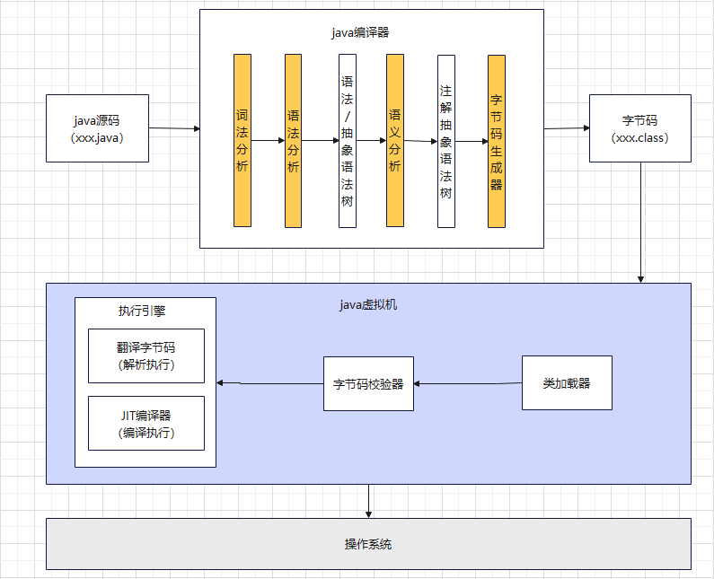
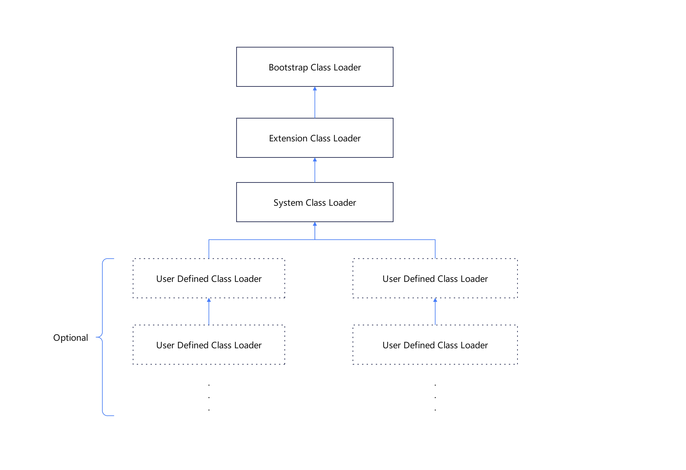
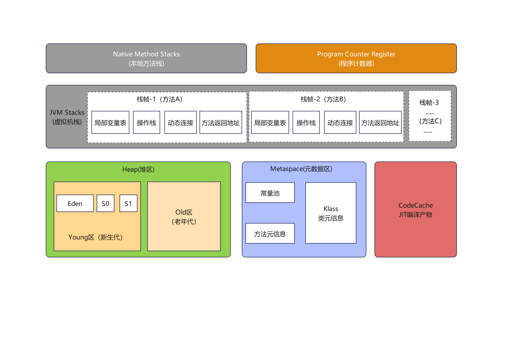
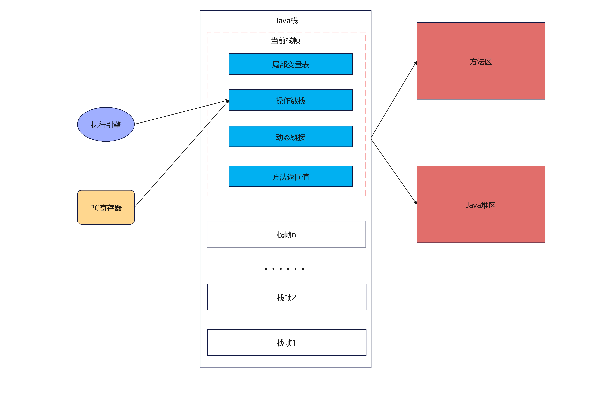
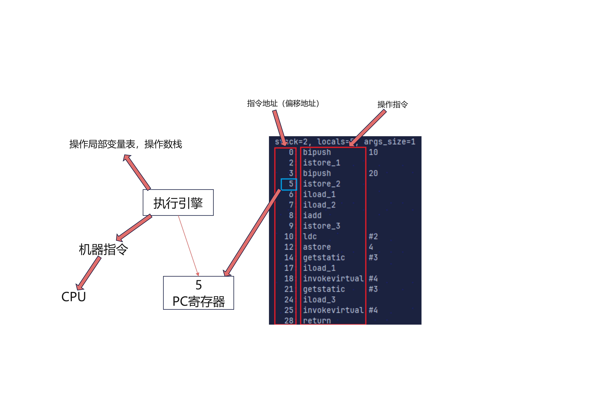
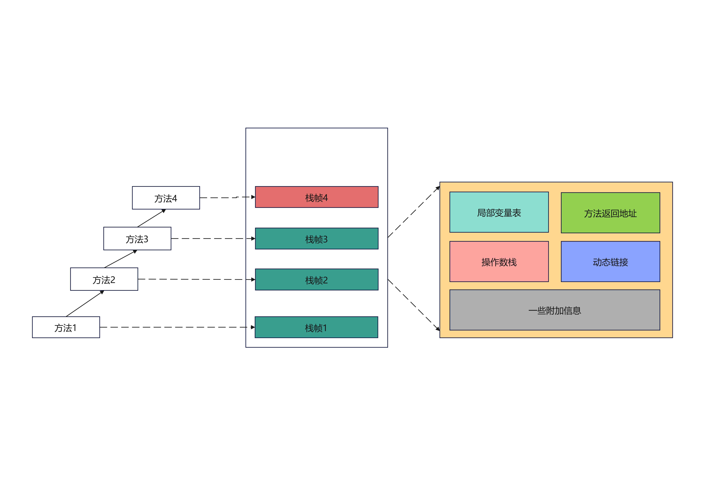
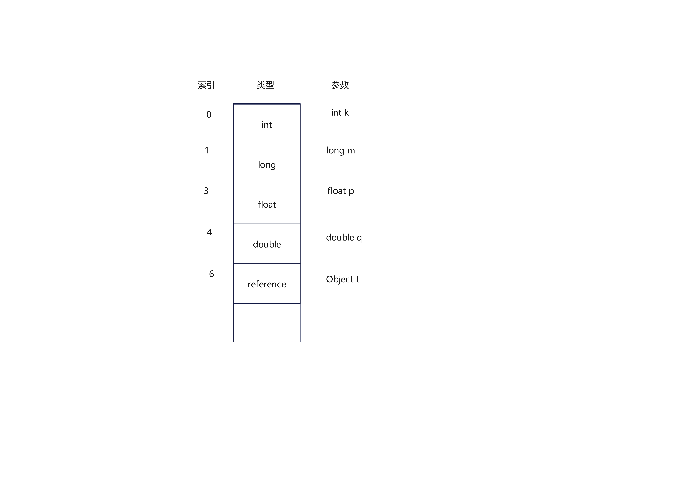
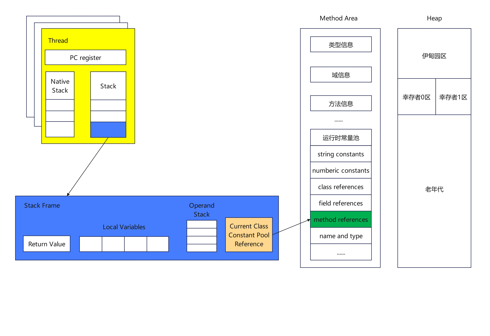

> 栈管运行，堆管存储

## java代码执行流程
1. 编译（前端编译，与执行引擎中的编译成热点代码（后端编译）形成区分），形成字节码文件
2. 字节码文件运行在jvm之上

## jvm的架构模型
> 一种是基于栈的指令集架构（Hotspot），另一种是基于寄存器的指令集架构。
> 基于栈的指令集架构以零地址为主，基于寄存器的指令集架构都以一地址指令，二地址指令，三地址指令为主
>
> .class文件反编译的命令为 javap -v xxx.class
> 
>  jps 查看执行中的进程

## 内存结构
### 概述
> 如果自己手写一个java虚拟机的话，主要考虑哪些结构呢？类加载器和执行引擎
>

### 类加载器子系统
> 负责从文件系统或者网络中加载Class文件。
> 加载的类信息放在一块称为方法区的内存空间。
> 除了类的信息外，方法区还会存放运行时常量池信息，可能还包括字符串字面量和数字常量（这部分常量信息是Class文件中常量池部分的内存映射）

### 类的加载过程(loading)
1. 通过一个类的全限定名获取定义此类的二进制字节流
2. 将这个字节流所代表的静态存储结构转化为方法区的运行时数据结构
3. 在内存中生成一个代表这个类的java.lang.Class对象，作为方法区这个类的各种数据的访问入口

### 类的加载过程(Linking)
> 验证，准备，解析
> final修饰的static,在编译的时候就会分配
> 解析：将常量池的符号引用转换为直接引用的过程
> jclasslib bytecode viewer, 打开字节码文件，可以安装idea插件，打开字节码文件
> binary Viewer, 查看字节码文件，HxD 也可以查看字节码文件

### 类的加载过程(Initialization)
- 初始化阶段就是执行类构造器方法&lt;clinit>()的过程
-  &lt;clinit>()不同于类的构造器（关联：构造器是虚拟机视角下的&lt;init>()）
- 此方法不需定义，是javac编译器自动收集类中的所有类变量的赋值动作和静态代码块中的语句合并而来
- 构造器方法中指令按语句在源文件中出现的顺序执行
- 若该类具有父类，jvm会保证子类的&lt;clinit>()执行前，父类的&lt;clinit>()已经执行完毕
- 虚拟机必须保证一个类的&lt;clinit>()方法在多线程下被同步加锁

### 类加载器的分类

> 上图四者之间的关系是包含关系。不是上层下层，也不是子父类的继承关系。
> jvm支持两种类型的类加载器，分别为引导类加载器（Bootstrap ClassLoader）和自定义类加载器（User-Defined ClassLoader）
> 将所有派生于抽象类ClassLoader 的类加载器都划分为自定义类加载器
> ctrl+H 查看类的继承关系

#### 启动类加载器（引导类加载器，Bootstrap ClassLoader）
  - 这个类加载使用c/c++语言实现的，嵌套在JVM内部
  - 并不继承自java.lang,ClassLoader,没有父加载器
  - 加载扩展类和应用程序类加载器，并指定为他们的父类加载器
  - 出于安全考虑，Bootstrap启动类加载器只加载包名为java,javax,sun等开头的类
#### 扩展类加载器（Extension ClassLoader）
  - 从java.ext.dirs系统属性所指定的目录中加载类库，或从JDK的安装目录的jre/lib/ext 子目录下加载类库。如果用户创建的JAR放在此目录下，也会自动由扩展类加载器加载。
#### 应用程序类加载器（系统类加载器，AppClassLoader）
  - 负责加载环境变量classpath或系统属性 java.class.path 指定路径下的类库
  - 该类加载器是程序中默认的类加载器，一般来说，java应用的类都是由它来完成加载
  - 通过ClassLoader#getSystemClassLoader()方法可以获取到该类加载器
#### 用户自定义类加载器
  - 为什么要自定义类加载器？
    - 隔离加载类（类冲突，做类的仲裁）
    - 修改类加载的方式
    - 扩展加载源
    - 防止源码泄露（对字节码文件加解密）
  - 开发人员可以通过继承抽象类java.lang.ClassLoader类的方式，实现自己的类加载器，以满足一些特殊的需求
  - 如果没有太过于复杂的需求，可以直接继承URLClassLoader类，这样就可以避免自己去编写findClass()方法及其获取字节码流的方式，使自定义类加载器编写更加简洁
#### 关于ClassLoader
> ClassLoader类，它是一个抽象类，其后所有的类加载器都继承自ClassLoader（不包括启动类加载器）
> sun.misc.Launcher 它是java虚拟机的入口应用
##### 获取ClassLoader的途径
1. 获取当前类的ClassLoader: clazz.getClassLoader()
2. 获取当前线程上下文的ClassLoader：Thread.currentThread().getContextClassLoader()
3. 获取系统的ClassLoader: ClassLoader.getSystemClassLoader()
4. 获取调用者的ClassLoader:DriverManager.getCallerClassLoader()

### 双亲委派机制
> java 虚拟机对class文件采用的是按需加载的方式，也就是说当需要使用该类时，才会将它的class文件加载到内存生成class对象。
> 而且加载某个类的class文件时，java虚拟机采用的是双亲委派模式，即把请求交由父类处理，它是一种任务委派模式，
#### 工作原理
1. 如果一个类加载器收到了类加载请求，它并不会自己去加载，而是把这个请求委托给父类的加载器去执行;
2. 如果父类加载器还存在其父类加载器，则进一步向上委托，依次递归，请求最终将到达顶层的启动类加载器
3. 如果父类加载器可以完成类加载任务，就成功返回，倘若父类加载器无法完成此加载任务，子加载器才会尝试自己去加载，这就是双亲委派模式。
#### 优势
> 避免类的重复加载
> 保护程序安全，防止核心API被随意篡改，自定义类：java.lang.String  java.lang.FxyStart

#### 沙箱安全机制
> 自定义String类，但是在加载自定义String类的时候会率先使用引导类加载器加载，而引导类加载器在加载的过程中会先加载jdk自带的文件（rt.jar包中java/lang/String.class）,
> 报错信息说没有main方法就是因为加载的是rt.jar包中的String类。这样可以保证对java核心源代码的保护，这就是沙箱安全机制。

#### 其他
> 在jvm中表示两个class对象是否为同一个类存在两个必要条件：
> 1. 类的完整类名必须一致，包括包名；
> 2. 加载这个类的ClassLoader(指ClassLoader实例对象)必须相同。
>
> JVM必须知道一个类型是由启动加载器加载的还是由用户类加载器加载的。如果一个类型是由用户类加载器加载的，那么JVM会将这个类加载器的一个引用作为类型信息的一部分保存在方法区中。
> 当解析一个类型到另一个类型的引用的时候，JVM需要保证这两个类型的类加载器是相同的。

### 运行时数据区

>jvm虚拟机定义了若干种程序运行期间会使用到的运行时数据区，其中有一些会随着虚拟机启动而创建，随着虚拟机退出而销毁。
> 另外一些则是与线程一一对应的，这些与线程对应的数据区域会随着线程开始和结束而创建和销毁
> 1. 每个线程：独立包括程序计数器，栈，本地栈。
> 2. 线程间共享：堆，堆外内存（永久代或元空间，代码缓存）
#### class Runtime
> 一个jvm实例对应一个runtime的实例

#### JVM中的线程说明
> 在Hotspot jvm 每个线程都与操作系统的本地线程直接映射；
> 当一个java线程准备好执行以后，此时一个操作系统的本地线程也同时创建。java线程执行终止后，本地线程也会回收。
> 
> Hotspot jvm里包括以下线程：虚拟机线程，周期任务线程，GC线程，编译线程（将字节码编译成本地代码），信号调度线程

#### PC寄存器
##### 概述

> JVM中的PC寄存器是对物理PC寄存器的一种抽象模拟。PC寄存器也称为程序钩子。
> 
> 作用：PC寄存器用来存储指向下一条指令的地址，也是即将要执行的指令代码，由执行引擎读取下一条指令。
##### 使用举例

##### 问题
> 1. 使用PC寄存器存储字节码指令地址有什么用呢？
> 
>   因为CPU需要不停地切换各个线程，切换回来以后，就得知道接着从哪开始继续执行。
>   jVM字节码解释器需要通过改变PC寄存器的值来明确下一条应该执行什么样的字节码指令。
> 2. PC寄存器为什么会被设定为线程私有？
>
>   为了能够准确地记录各个线程正在执行的当前字节码指令地址，最好的办法自然是为每一个线程都分配一个PC寄存器。

#### 虚拟机栈
##### 概述
> java指令都是根据栈来设计的。每个线程都会创建一个虚拟机栈，其内部保存一个个的栈帧，对应这一次次的java方法调用。
> 生命周期和线程一致。访问速度仅次于程序计数器。对于栈来说不存在垃圾回收问题，可能存在内存溢出的问题
> 
> 作用：主管java程序的运行，它保存方法的局部变量（8种基本数据类型、对象的引用地址 ）、部分结果，并参与方法的调用和返回。
> 局部变量vs成员变量（或属性）
> 基本数据类型 vs 引用数据类型（类，数组，接口）

##### 虚拟机栈的异常
> java栈的大小是动态的或者是固定不变的
> 
> 固定大小的java虚拟机栈(Hotspot中默认是固定大小的)，可能会抛出StackOverflowError
> 
> 如果java虚拟机栈可以动态扩展，可能会抛出一个OutOfMemoryError；使用 -Xss 选项设置虚拟机栈的大小

##### 栈的存储结构和运行原理
> 栈中的数据都是以栈帧为单位存在的，每个方法都各自对应一个栈帧。栈帧是一个内存块区，是一个数据集，维系着方法执行过程中的各种数据信息
> 
> OOP的基本概念：类，对象;
> 类中基本结构：field(属性，字段，域)、method

> 1. 不同线程中所包含的栈帧是不允许存在相互引用的，即不可能在一个栈帧之中引用另外一个线程的栈帧
> 2. 如果当前方法调用了其他方法，方法返回之际，当前栈帧会传回此方法的执行结果给前一个栈帧，接着，虚拟机会丢弃当前栈帧，使得前一个栈帧重新成为当前栈帧。
> 3. java方法有两种返回函数的方式，一种是正常的函数返回，使用return指令；另外一种是抛出异常。不管使用哪种方式，都会导致栈帧被弹出。

##### 栈帧的内部结构

> 局部变量表(Local Variables) 
> 操作数栈(Operand Stack)(或表达式栈) 
> 动态连接(Dynamic Linking)(或指向运行时常量池的方法引用) 
> 方法返回地址（Return Address）(或方法正常退出或者异常退出的定义) 
> 一些附加信息

###### 局部变量表
> 定义为一个数字数组，主要用于存储方法参数和定义在方法体内的局部变量，这些数据类型包括各类基本数据类型，对象引用，以及returnAddress类型 
> 由于局部变量表是建立在线程的栈上，是线程的私有数据，因此不存在数据安全问题 
> 局部变量表所需的容量大小是在编译期确定下来的，并保存在方法的Code属性的 maximum local variables(局部变量最大槽数)数据项中。在方法运行期间是不会改变局部变量表的大小的。 
> 方法嵌套调用的次数由栈的大小决定。一般来说，栈越大，方法嵌套调用次数越多。对一个函数而言，它的参数和局部变量越多，使得局部变量表膨胀，它的栈帧就越大，以满足方法调用所需传递的信息增大的需求。进而函数调用就会占用更多的栈空间，导致其嵌套调用次数就会减少。 
> 局部变量表中的变量只在当前方法调用中有效。在方法执行时，虚拟机通过使用局部变量表完成参数值到参数变量列表的传递过程。当方法调用结束后，随着方法栈帧的销毁，局部变量表也会随之销毁。 
> 局部变量表中,start PC 为变量声明后的下一行; length 表示变量的作用域的范围

###### 局部变量表--slot
> 局部变量表，最基本的存储单元就是Slot(变量槽)
> 局部变量表中存放编译期可知的各种基本数据类型（8种），引用类型（reference）,returnAddress类型的变量
> 在局部变量表里，32位以内的类型只占用一个slot（包括returnAddress类型），64位的类型（long和double）占用两个slot
> byte,short,char在存储器被转换为int，boolean也被转换为int,0 表示false，非0表示true；
> long和double则占据两个slot
> 
> 
> jvm会为局部变量表中的每一个slot都分配一个访问索引，通过这个索引即可成功访问到局部变量表中指定的局部变量值。
> 
> 当一个实例方法被调用的时候，它的方法参数和方法体内部定义的局部变量将会按照顺序被复制到局部变量表中的每一个slot上
> 
> 如果需要访问局部变量表中一个64bit的局部变量值时，只需要使用前一个索引即可。（比如：访问long或double类型变量）
> 
> 如果当前帧是由构造方法或者实例方法创建的，那么该对象引用this将会存放在index为0的slot处，其余的参数按照参数表顺序继续排列。（静态方法是不可以引用this的）

###### 局部变量表--slot的重复利用
> 栈帧中的局部变量表中的槽位是可以重用的，如果一个局部变量过了其作用域，那么在其作用域之后声明的新的局部变量就很有可能会复用过期局部变量的槽位，从而达到节省资源的目的。
###### 局部变量表--静态变量与局部变量的对比
> 局部变量没有赋值不能够使用
###### 局部变量表--其他
> 在栈帧中，与性能调优关系最为密切的部分就是前面提到的局部变量表。在方法执行时，虚拟机使用局部变量表完成方法的传递。
> 
> 局部变量表中的变量也是重要的垃圾回收根节点，只要被局部变量表中直接或间接引用的对象都不会被回收。

###### 操作数栈
> 每一个独立的栈帧中除了包含局部变量表以外，还包含一个后进先出的操作数栈，也可以称之为表达式栈。
> 
> 操作数栈，在方法执行过程中，根据字节码指令，往栈中写入数据或提取数据，即入栈（push）/出栈（pop）
>   - 某些字节码指令将值压入操作数栈，其余的字节码指令操作数取出栈。使用他们后再把结果压入栈。
>   - 比如：执行复制、交换、求和等操作
> 
> java虚拟机的解释引擎是基于栈的执行引擎，其中的栈指的就是操作数栈。
> 
> 操作数栈，主要用于保存计算过程的中间结果，同时作为计算过程中变量临时的存储空间。
> 
> 操作数栈就是JVM执行引擎的一个工作区，当一个方法刚开始执行的时候，一个新的栈帧也会随之被创建出来，这个方法的操作数栈是空的。
> 
> 每一个操作数栈都会拥有一个明确的栈深度用于存储数值，其所需的最大深度在编译期就定义好了，保存在方法的code属性中，为max_stack的值。
> 
> 栈中的任何一个元素都是可以任意的Java数据类型。
>  
>  - 32bit的类型占用一个栈单位深度
>  - 64bit的类型占用两个栈单位深度
> 
> 操作数栈并非采用访问索引的方式来进行数据访问的，而是只能通过标准的入栈（push）和出栈（pop）操作来完成一次数据访问。
> 
> 如果被调用的方法带有返回值的话，其返回值将会被压入当前栈帧的操作数栈中，并更新PC寄存器中下一条需要执行的字节码指令。
> 
> 操作数栈中元素的数据类型必须与字节码指令的序列严格匹配，这由编译器在编译期间进行验证，同时在类加载过程中的类检验阶段的数据流分析阶段要再次验证

###### 操作数栈--栈顶缓存
> 由于操作数是存储在内存中的，因此频繁地执行内存读/写操作必然会影响执行速度。
> 为了解决这个问题，HotSpot JVM 的设计者们提出了栈顶缓存（ToS, Top-of-Stack Cashing）技术，将栈顶元素全部缓存在屋里CPU的寄存器中，以此降低对内存的读/写次数，提升执行引擎的执行效率。
>
###### 动态链接（或指向运行时常量池的方法引用）
> 每一个栈帧内部都包含一个指向运行时常量池中该栈帧所属方法的引用，包含这个引用的目的就是为了支持当前方法的代码能够实现动态链接（Dynamic Linking）。
> 比如：invokedynamic指令
> 
> 在java源文件被编译到字节码文件中时，所有的变量和方法引用都作为符号引用（Symbolic Reference）保存在class文件的常量池里。
> 比如：描述一个方法调用了另外的其他方法时，就是通过常量池中指向方法的符号引用来表示的，那么动态链接的作用就是为了将这些符号引用转换为调用方法的直接引用。
> 
> 
> 为什么需要常量池？
> 常量池的作用，就是为了提供一些符号和常量，便于指令的识别。

###### 方法的调用
> 在JVM中，将符号引用转换为调用方法的直接引用与方法的绑定机制相关。
> 
> 1. 静态链接
>         
>   当一个字节码文件被装载进JVM内部时，如果被调用的目标方法在编译期可知，且运行期保持不变时。这种情况下将调用方法的符号引用转换为直接引用的过程称之为静态链接。
> 
> 2. 动态链接
>   
>   如果被调用的方法在编译期无法被确定下来，也就是说，只能够在程序运行期将调用方法的符号引用转换为直接引用，由于这种引用转换过程具备动态性，因此也就被称之为动态链接。
> 
> 对应的方法的绑定机制为：早期绑定和晚期绑定。绑定是一个字段，方法或者类在符号引用被替换为直接引用的过程，这仅仅发生一次。
> 
> - 早期绑定
> 
>   早期绑定就是指被调用的目标方法如果在编译期可知，且运行期保持不变时，即可将这个方法与所属的类型进行绑定，这样一来，由于明确了被调用的目标方法究竟是哪一个，
>   因此也就可以使用静态链接的方式将符号引用转换为直接引用。
> 
> - 晚期绑定
>   如果被调用的方法在编译期无法被确定下来，只能够在程序运行期根据实际的类型绑定相关的方法，这种绑定方式也就被称之为晚期绑定。
> 
> 
> invokevirtual、 invokeinterface 对应着晚期绑定，动态链接
> 
> 多态性体现在具备早期绑定和晚期绑定两种绑定方式；java中任何一个普通的方法其实都具备虚函数的特征（即晚期绑定的特点），他们相当于
> C++语言中的虚函数（C++中需要使用关键字virtual来显示定义）；如果在java程序中不希望某个方法拥有虚函数的特征时，则可以使用关键字final来标记这个方法。
###### 方法的调用-非虚方法
> 如果方法在编译期就确定了具体的调用版本，这个版本在运行时是不可变的。这样的方法称为非虚方法。
> 
> 静态方法、私有方法、final方法、实例构造器、父类方法都是非虚方法。
> 
> 其他方法都是虚方法。
> 
> 子类对象的多态性的使用前提：1.类的继承关系；2.方法的重写（接口的实现等）
> 
> 虚拟机中提供了以下几条方法调用指令：
> 
> - 普通调用指令：
>   1. invokestatic:调用静态方法，解析阶段确定唯一方法版本
>   2. invokespecial:调用<init>方法，私有及父类方法，解析阶段确定唯一方法版本
>   3. invokevirtual:调用所有虚方法
>   4. invokeinterface:调用接口方法
> - 动态调用指令
>   5. invokedynamic:动态解析出需要调用的方法，然后执行
> 
> 前四条指令固化在虚拟机内部，方法的调用执行不可人为干预，而invokedynamic指令则支持由用户确定方法版本。
> 其中invokestatic指令和invokespecial指令调用的方法称为非虚方法，其余的（final修饰的除外）称为虚方法
> 
> 直到java8的lambda表达式的出现，invokedynamic指令的生成，在java中才有了直接的生成方式。

###### 方法的调用-invokedynamic指令的使用
- 动态类型语言与静态类型语言
- 静态类型语言是判断变量自身的类型信息；动态类型语言是判断变量值的类型信息，变量没有类型信息，变量值才有类型信息，这是动态语言的一个重要特征
- java是静态类型语言，invokedynamic增加了动态语言特性

###### 方法的调用-方法重写的本质
> java语言中方法重写的本质：
> 1. 找到操作数栈顶的第一个元素所执行的对象的实际类型，记作C
> 2. 如果在过程结束:如果不同类型C中找到与常量中的描述符合简单名称都相符的方法，则进行访问权限校验，如果通过则返回这个方案的直接引用，查找过，则返回java.lang.IllegalAccessError异常
> 3. 否则，按照继承关系从下往上一次对C的各个父类进行第2步的搜索和验证过程。
> 4. 如果始终没有找到合适的方法，则抛出java.lang.AbstractMethodError异常

> IllegalAccessError介绍：
> 
> 程序视图访问或修改一个属性或调用一个方法，这个属性或方法，你没有权限访问。一般的，这个会引起编译器异常，这个错误如果发生在运行时，就说明一个类发生了不兼容的改变。

> - 在面向对象的编程中，会很频繁地使用到动态分派，如果在每次动态分派的过程中都要重新在类的方法元数据中搜索合适的目标的话就可能影响到执行效率。
> 因此，为了提高性能，JVM采用在类的方法区建立一个虚方法表（virtual method table）(非虚方法不会出现在表中)来实现。使用索引表来代替查找。
> - 每个类中都有一个虚方法表，表中存放着各个方法的实际入口
> - 那么虚方法表什么时候被创建？
> 虚方法表会在类加载的链接阶段被创建并开始初始化，类的变量初始值准备完成后，JVM会把该类的方法表也初始化完毕

###### 方法返回地址
> - 存放调用该方法的pc寄存器的值。
> - 一个方法的结束，有两种方式：
>   1. 正常执行完成
>   2. 出现未处理的异常，非正常退出
> - 无论通过哪种方式退出，在方法退出后都返回到该方法被调用的位置。方法正常退出时，调用者的pc计数器的值作为返回地址，即调用该方法的指令的下一条指令的地址。
> - 而通过异常退出的，返回地址是要通过异常表来确定，栈帧中一般不会保存这部分信息。
> - 本质上，方法的退出就是当前栈帧出栈的过程。此时，需要恢复上层方法的局部变量表、操作数栈、将返回值压入调用者栈帧的操作数栈、设置PC寄存器等，让调用者方法继续执行下去。
> - 正常完成出口和异常完成出口的区别在于：通过异常完成出口退出的不会给它的上层调用者产生任何的返回值。
> - 当一个方法开始执行后，只有两种方式可以退出这个方法：
>  1. 执行引擎遇到任意一个方法返回的字节码指令（return）,会有返回值传递给上层的方法调用者，简称正常完成出口；
>     - 一个方法在正常调用完成之后究竟使用哪一个返回指令还需要根据方法返回值的实际数据类型而定
>     - 在字节码指令中，返回指令包含ireturn(当返回值是boolean,byte,char,short和int类型时使用)、lreturn、freturn、dreturn以及areturn,另外还有一个return指令供声明为void的方法、实例初始化方法、类和接口的初始化方法使用
>  2. 在方法执行的过程中遇到异常（Exception）,并且这个异常没有在方法内进行处理，也就是只要在本方法的异常表中没有搜索到匹配的异常处理器，就会导致方法退出。简称异常完成出口，
>     方法执行过程中抛出异常时的异常处理，存储在一个异常处理表，方便在发生异常的时候找到处理异常的代码，
###### 栈帧中的一些附加信息
> 栈帧中还允许携带与Java虚拟机实现相关的一些附加信息。例如，对程序调试提供支持的信息。
