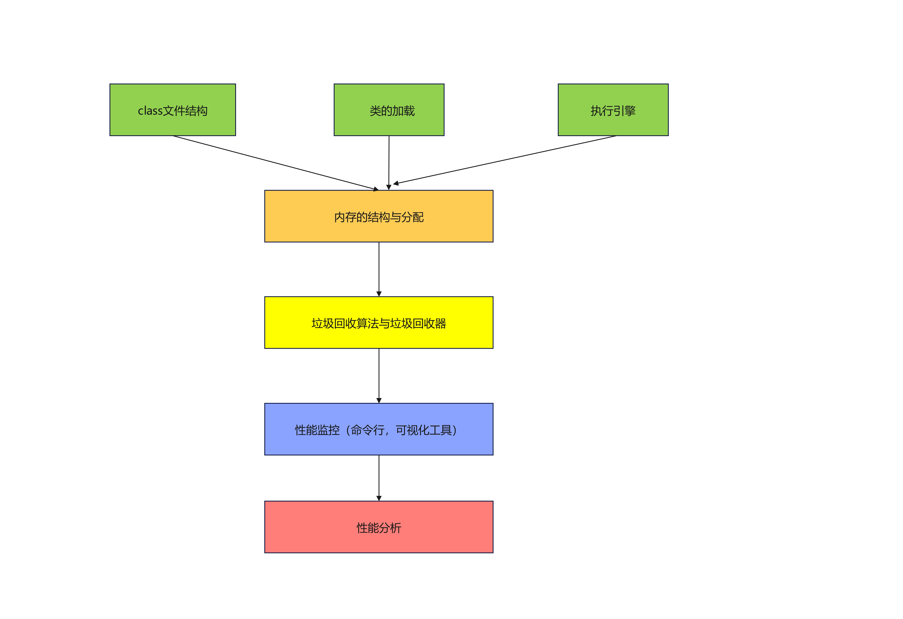

# 第1章--Class文件结构

## 前端编译器

javac是一种能够将java源码编译为字节码的前端编译器
静态提前编译器（AOT编译器）直接把.java文件编译成本地机器指令

字节码（byte code）:操作码+操作数 / 单独操作码

## class文件结构

class文件的本质：class文件是一组以8位字节为基础单位的二进制数据流。

class文件格式采用一种类似于C语言结构体的方式进行数据存储，这种结构中只有两种数据类型：无符号数和表
无符号数：u1（1字节）、u2（2字节）、u4（4字节）、u8（8字节）；无符号数可以用来描述数字、索引引用、数量值或者按照UTF-8编码构成字符串值 
表：一组相关联的数据项的集合；整个Class文件本质上就是一个表，由于表没有固定长度，所有通常会在其前面加上个数说明

# 第2章--字节码指令集与解析举例

# 第3章--类的加载过程详解

# 第4章--再谈类的加载器