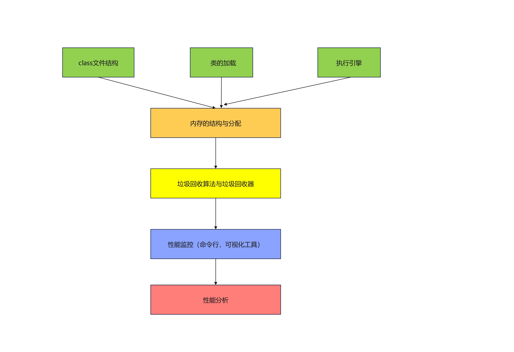

# 第1章--Class文件结构

## 前端编译器

javac是一种能够将java源码编译为字节码的前端编译器
静态提前编译器（AOT编译器）直接把.java文件编译成本地机器指令

字节码（byte code）:操作码+操作数 / 单独操作码

## class文件结构

class文件的本质：class文件是一组以8位字节为基础单位的二进制数据流。

class文件格式采用一种类似于C语言结构体的方式进行数据存储，这种结构中只有两种数据类型：无符号数和表
无符号数：u1（1字节）、u2（2字节）、u4（4字节）、u8（8字节）；无符号数可以用来描述数字、索引引用、数量值或者按照UTF-8编码构成字符串值
表：一组相关联的数据项的集合；整个Class文件本质上就是一个表，由于表没有固定长度，所有通常会在其前面加上个数说明。

class文件的总体结构如下：

- 魔数：识别class文件的唯一标识，固定值0xCAFEBABE
- Class文件版本：minor_version和major_version
- 常量池:Class文件中内容最为丰富的区域之一（资源仓库），用于存储类和接口的各种字面量和符号引用，是Java运行时数据区中的运行时常量池的静态表示
    - 常量池计数器：u2类型，表示常量池中常量的数量，注意常量池的索引是从1开始的，任何都不引用索引0
    - 常量池表：常量池中的具体内容，由一系列常量池项组成，每个常量池项都有一个标志位，表示该项的类型
        - 描述符的作用：描述符用于唯一标识类、接口、字段和方法的类型信息，方法的参数列表和返回值类型
        - 这14种常量池项类型：
            - CONSTANT_Class_info（类或接口的符号引用）
            - CONSTANT_Fieldref_info（字段的符号引用）
            - CONSTANT_Methodref_info（类中方法的符号引用）
            - CONSTANT_InterfaceMethodref_info（接口中方法的符号引用）
            - CONSTANT_String_info（字符串字面量）
            - CONSTANT_Integer_info（整数字面量）
            - CONSTANT_Float_info（浮点数字面量）
            - CONSTANT_Long_info（长整型字面量）
            - CONSTANT_Double_info（双精度浮点数字面量）
            - CONSTANT_NameAndType_info（字段或方法的名称和描述符）
            - CONSTANT_Utf8_info（UTF-8编码的字符串）
            - CONSTANT_MethodHandle_info（方法句柄）
            - CONSTANT_MethodType_info（方法类型）
            - CONSTANT_InvokeDynamic_info（动态调用点）
        - 共同点为第一位是一个u1类型的tag标志位，表示该常量池项的类型
        - 不同点为后续的结构不同，表示不同类型的常量池项所需的信息也不同
- 访问标志：access_flag,类或接口的访问权限和属性的标志位集合
    - 常见的访问标志：
        - ACC_PUBLIC：公共类或接口
        - ACC_FINAL：不可继承的类或不可重写的方法
        - ACC_SUPER：使用新的方法调用语义（JDK 1.0引入）
        - ACC_INTERFACE：接口
        - ACC_ABSTRACT：抽象类或接口
        - ACC_SYNTHETIC：编译器生成的类、方法或字段
        - ACC_ANNOTATION：注解类型
        - ACC_ENUM：枚举类型
- 类索引，父类索引，接口索引集合
- 字段表集合：包括类级变量以及实例级变量
    - 例如字段的标识符，访问修饰符（public,private或protected）,是类变量还是实例变量（static修饰符），是否是常量（final修饰符）
    - 注意：
        - 字段表集合中不会列出从父类或者实现的接口中继承而来的字段，但有可能列出原本java代码中不存在的字段。
        - 在java语言中字段是无法重载的，两个字段的数据类型、修饰符不管是否相同，都必须使用不一样的名称，但是对于字节码来讲，如果两个字段的描述符不一致，那字段重名就是合法的。
    - 字段计数器
    - 字段表
      每个成员都必须是一个fields_info结构的数据项
      字段表作为一个表，同样有自己的结构：
        - 访问标志
        - 字段名索引
        - 字段描述符索引
        - 属性计数器
        - 属性集合：一个字段还可能拥有一些属性，用于存储更多的额外信息。比如初始化值，一些注释信息等。
            - 属性名索引
            - 属性长度
            - 常量值索引（可选）：如果字段是用final修饰的，并且在声明时赋值了一个编译时常量，那么这个属性就会存在
- 方法表集合
    - 注意：
      方法表集合中不会列出从父类或者实现的接口中继承而来的方法，但有可能列出原本java代码中不存在的方法，比如类的构造方法<init>
      和类的静态初始化方法<clinit>。
      在java语言中方法是可以重载的，允许在同一个类中定义多个名称相同但参数列表不同的方法。但是对于字节码来讲，允许存放多个方法前面相同的方法，唯一的条件就是这些方法之间的返回值不能相同
    - 方法计数器
    - 方法表
      每个方法都必须是一个method_info结构的数据项
      方法表作为一个表，同样有自己的结构：
    - 访问标志：多个选项的组合
    - 方法名索引
    - 方法描述符索引
    - 属性计数器
    - 属性集合：方法的属性中最重要的就是Code属性，它存储了方法的字节码指令，还有一些其他的信息，比如局部变量表，操作数栈的深度等。
    - 属性名索引
    - 属性长度
    - 最大栈深度
    - 最大局部变量表大小
    - 字节码长度
    - 字节码指令
    - 异常表长度
    - 异常表
    - 属性计数器
- 属性表集合
    - 指的是class文件所携带的辅助信息，比如该class文件的源文件名，调试信息，注解信息等
    - java8中定义了23种属性类型

## 使用javap指令解析class文件

使用javac -g xx.java可以生成包含局部变量表的class文件

javap的用法格式：
javap <options> <classes>

-help --help -? 输出此用法消息
-version 版本信息,其实就是javap的版本号

-public 仅显示公共类和成员
-protected 显示受保护的/公共类和成员
-p -private 显示所有类和成员
-package 显示程序包/受保护的/公共类 和成员 (默认)
-sysinfo 显示正在处理的类的 系统信息 (路径, 大小, 日期, MD5 散列)
-constants 显示最终常量

-s 输出内部类型签名
-l 输出行号和本地变量表
-v -verbose 输出附加信息
-c 对代码进行反汇编

-classpath <path>           指定查找用户类文件的位置
-cp <path>                  指定查找用户类文件的位置
-bootclasspath <path>       覆盖引导类文件的位置

javap -v -p .\JavapTest.class > 1.txt // 包括私有成员的反编译后的信息，并输出到1.txt文件中

# 第2章--字节码指令集与解析举例

## 概述

### 执行模型

java虚拟机的指令由一个字节长度的操作码（opcode）和可选的操作数组成
操作码是一个8位无符号整数，取值范围从0到255，共256个不同的操作码
每个操作码对应一种特定的操作，比如加载变量、存储变量、算术运算、类型转换、对象创建、方法调用等

### 字节码与数据类型

i代表对int类型数据的操作
l代表对long类型数据的操作
s代表对short类型数据的操作
b代表对byte类型数据的操作
c代表对char类型数据的操作
f代表对float类型数据的操作
d代表对double类型数据的操作
a代表对引用类型数据的操作
无类型操作码没有类型前缀，比如nop、pop、dup等

- 一个指令，可以从局部变量表、常量池、堆中对象、方法调用、系统调用中等取得数据，这些数据（可能是值，可能是对象的引用）被压入操作数栈
- 一个指令，也可以从操作数栈中取出一到多个值（pop多次），完成赋值、加减乘除、方法传参、系统调用等操作
- 一个指令，还可以把结果值压入操作数栈，供后续指令使用

## 加载与存储指令

- 局部变量压栈指令，将一个局部变量加载到操作数栈顶：xload, xload_<n>(其中x为i,l,f,d,a,s,b,c之一，n为0-3)
- 常量入栈指令，将一个常量值加载到操作数栈顶,根据数据类型和入栈内容的不同，又可以分为const系列，push系列和ldc系列三种：
    - const系列：iconst_<n>(n为-1到5), lconst_<n>(n为0-1), fconst_<n>(n为0-2), dconst_<n>(n为0-1), aconst_null
    - push系列： bipush(接收8位整数作为参数), sipush(接收16位整数作为参数)
    - ldc系列（它可以接收一个8位的参数，该参数指向常量池中的int、float或者String的索引，将指定的内容压入操作数栈）：
      ldc, ldc_w（两个8位参数）, ldc2_w（压入的元素是long或double类型的）
- 出栈装入局部变量表指令，将操作数栈顶的值存入到局部变量表中：xstore, xstore_<n>(其中x为i,l,f,d,a,s,b,c之一，n为0-3)

操作数栈，用来存放计算的操作数以及返回结果

## 算数指令

- 加法指令：iadd, ladd, fadd, dadd
- 减法指令：isub, lsub, fsub, dsub
- 乘法指令：imul, lmul, fmul, dmul
- 除法指令：idiv, ldiv, fdiv, ddiv
- 取模指令：irem, lrem, frem, drem // remainder：余数
- 取反指令：ineg, lneg, fneg, dneg //negation:取反
- 自增指令：iinc（该指令用于对局部变量表中的int类型变量进行自增操作，它接收两个参数：局部变量表索引和增量值）
- 位运算指令：
    - 位移指令：ishl, ishr,lshl, lshr, iushr, lushr
    - 按位与指令：iand, land,
    - 按位或指令：ior, lor,
    - 按位异或指令：ixor, lxor
- 比较指令,比较栈顶的两个元素的大小，并将比较结果入栈，指令有：lcmp, fcmpl, fcmpg, dcmpl, dcmpg
  如果遇到Nan值，fcmpg会将比较结果置为1，而fcmpl会将比较结果置为-1

## 类型转换指令

用于实现用户代码中的显式类型转换

### 宽化类型转换

从小范围类型转换为大范围类型的过程称为宽化类型转换（Widening Primitive Conversion），自动类型提升
从byte、short、char类型转换为int类型的宽化类型转换是不存在的，因为在Java虚拟机中，byte、short、char类型的变量在进行算术运算时，都会被自动提升为int类型

- i2l, i2f, i2d
- l2f, l2d
- f2d

简化为：int->long->float->double

### 窄化类型转换

从大范围类型转换为小范围类型的过程称为窄化类型转换（Narrowing Primitive Conversion），强制类型转换

- l2i, f2i, d2i
- i2b, i2c, i2s
- d2f, f2l, d2l

## 对象的创建与访问指令

### 创建指令

- 创建类实例的指令
    - new：用于创建一个新的对象实例，它接收一个参数，该参数是常量池中一个类或接口的符号引用，表示要创建的对象的类型
- 创建数组的指令
    - newarray：用于创建一个新的基本类型数组，它接收一个参数，表示数组的类型
    - anewarray：用于创建一个新的引用类型数组，它接收一个参数，该参数是常量池中一个类或接口的符号引用，表示数组中元素的类型
    - multianewarray：用于创建一个多维数组，它接收两个参数，第一个参数是常量池中一个类或接口的符号引用，表示数组的类型，第二个参数是一个8位整数，表示数组的维度
- 取数组长度的指令
    - arraylength：用于获取数组的长度，该指令在执行时，会从操作数栈中弹出一个数组引用，获取数组的长度，将长度压入操作数栈顶

### 字段访问指令

- 访问类字段(static字段，或者成为类变量)的指令：getstatic, putstatic
- 访问实例字段(非static字段，或者成为实例变量)的指令：getfield, putfield

### 数组操作指令

数组操作指令主要有：xastore和xaload（其中x为i,l,f,d,a,s,b,c之一）

- 把一个数组元素加载到操作数栈的指令：xaload;
  指令xaload在执行时，会从操作数栈中弹出两个值：数组索引和数组引用，然后根据数组引用找到对应的数组对象，再根据数组索引获取数组元素的值，最后将该值压入操作数栈顶。
- 把操作数栈顶的一个值存入到数组元素的指令：xastore;
  指令xastore在执行时，会从操作数栈中弹出三个值：要存储的值、数组索引和数组引用，然后根据数组引用找到对应的数组对象，再根据数组索引将要存储的值存入到数组元素中。

### 类型检测指令

检查类实例或数组类型的指令:instanceof、checkcast

- instanceof指令用于判断一个对象是否是某个类或接口的实例，它会将判断结果压入操作数栈顶，结果为1表示是该类或接口的实例，结果为0表示不是
- checkcast指令用于检测一个对象是否可以被强制转换为某个类或接口的类型

## 方法调用与返回指令

### 方法调用指令

- invokevirtual：用于调用普通的实例方法，它接收一个参数，该参数是常量池中一个方法的符号引用，表示要调用的方法
- invokeinterface：用于调用接口中的方法，它接收多个参数，第一个参数是常量池中一个接口方法的符号引用，后续参数用于指定方法调用的细节
- invokespecial：用于调用实例初始化方法（构造方法）、私有方法以及父类的方法，它接收一个参数，该参数是常量池中一个方法的符号引用，表示要调用的方法（这些方法都是静态绑定的，不会在调用时进行动态派发。）
- invokestatic：用于调用静态方法（static方法，这也是静态绑定的），它接收一个参数，该参数是常量池中一个方法的符号引用，表示要调用的方法
- invokedynamic：用于动态方法调用，它接收一个参数，该参数是常量池中一个动态调用点的符号引用，表示要调用的方法

### 方法返回指令

包括ireturn（返回int类型的值）, lreturn（返回long类型的值）, freturn（返回float类型的值）, dreturn（返回double类型的值）,
areturn（返回引用类型的值）, return（返回void类型）；

如果当前返回的是synchronized方法，那么还会执行一个隐含的monitorexit指令，退出临界区

## 操作数栈管理指令

- 将一个或两个元素从栈顶弹出，并且直接废弃：pop, pop2
- 将栈顶的一个元素复制并压入栈顶：dup（复制1个槽位的数据）, dup_x1（复制1个槽位的数据，放在1+1后）, dup_x2, dup2（复制两个槽位的）,
  dup2_x1(复制两个槽位的，放在2+1后), dup2_x2
- 将栈顶的两个元素交换位置：swap
- 指令nop：该指令什么也不做，通常用于占位或者对齐

## 控制转移指令

### 条件跳转指令

他们的统一含义为：根据栈顶的数值是否满足某个条件来决定是否跳转到指定的指令地址

- ifeq,当栈顶int类型数值等于0时跳转
- ifne,当栈顶int类型数值不等于0时跳转
- iflt,当栈顶int类型数值小于0时跳转
- ifle：当栈顶int类型数值小于或等于0时跳转
- ifgt,当栈顶int类型数值大于0时跳转
- ifge,当栈顶int类型数值大于或等于0时跳转
- ifnull,当栈顶引用类型数值为null时跳转
- ifnonnull,当栈顶引用类型数值不为null时跳转

### 比较条件跳转指令

- if_icmpeq,当栈顶的两个int类型数值相等时跳转
- if_icmpne,当栈顶的两个int类型数值不相等时跳转
- if_icmplt,当栈顶的两个int类型数值第一个小于第二个时跳转
- if_icmple,当栈顶的两个int类型数值第一个小于或等于第二个时跳转
- if_icmpgt,当栈顶的两个int类型数值第一个大于第二个时跳转
- if_icmpge,当栈顶的两个int类型数值第一个大于或等于第二个时跳转
- if_acmpeq,当栈顶的两个引用类型数值相等时跳转
- if_acmpne,当栈顶的两个引用类型数值不相等时跳转

### 多条件分支跳转指令

主要有tableswitch和lookupswitch两种指令，他们的作用都是根据栈顶的int类型数值与某些特定的值进行比较来决定跳转地址

- tableswitch指令适用于case标签值连续的switch语句，它会根据栈顶的int类型数值与一个范围内的连续整数进行比较来决定跳转地址
- lookupswitch指令适用于case标签值不连续的switch语句，它会根据栈顶的int类型数值与一组不连续的整数进行比较

### 无条件跳转指令

- goto, goto_w：无条件跳转到指定的指令地址，goto_w指令使用32位的偏移量，可以跳转更远的距离

### 抛出异常指令

异常及异常的处理：

1. 异常对象的生成过程 -> throw(手动/自动)      ------> 指令：athrow
2. 异常的处理：抓抛模型.tray-catch-finally -----> 使用异常表

### 异常处理与异常表

#### 异常处理

在java虚拟机中，处理异常（catch语句）不是由字节码指令来实现的，而是采用异常表来完成的。

#### 异常表

如果一个方法定义了一个try-catch或者try-finally的异常处理，就会创建一个异常表。异常表保存了每个异常处理信息。比如

- 起始位置
- 结束位置
- 程序计数器记录的代码处理的偏移地址
- 被捕获的异常类在常量池中的索引

当一个异常被抛出时，jvm会在当前的方法里寻找一个匹配的处理，如果没有找到，这个方法会强制结束并弹出当前栈帧。
不管什么时候抛出异常,如果异常处理最终匹配了所有异常类型，代码就会继续执行。

### 同步控制指令

方法级的同步和方法内部一段指令序列的同步，这两种同步都是使用monitor来支持的。

方法级的同步是隐式的。方法的访问标识中存在 synchronized

方法内部一段指令序列的同步，monitorenter指令请求进入，monitorexit指令声明退出

# 第3章--类的加载过程详解

## 概述

基本数据类型由虚拟机预先定义，引用数据类型则需要进行类的加载。
类的声明周期包括如下7个阶段：

1. 加载（Loading）：通过类的全限定名来获取定义此类的二进制字节流，并将其存储在方法区中，同时为类创建一个java.lang.Class对象，作为方法区中类数据的访问入口
2. 验证（Verification）：确保被加载的类文件符合jvm规范，并且不会危害虚拟机安全
3. 准备（Preparation）：为类的静态变量分配内存，并将其初始化为默认值
4. 解析（Resolution）：将类中的符号引用转换为直接引用
5. 初始化（Initialization）：执行类的初始化方法<clinit>，为静态变量赋予正确的初始值
6. 使用（Using）：类被使用，比如创建对象、调用静态方法、访问静态字段等
7. 卸载（Unloading）：当类不再被使用时，jvm会回收类的相关资源，卸载类

## 过程一：Loading(加载)阶段

将java类的字节码文件加载到机器内存中，并在内存中构建出java类的原型--类模板对象。
反射的机制即基于这一基础。
加载阶段，简言之，查找并加载类的二进制数据，生成Class的实例。

## 过程二：Linking(链接)阶段

- verification(验证)：它的目的是保证加载的字节码是合法、合理并符合规范的。
  栈映射帧就是在这个阶段，用于检测在特定的字节码处，其局部变量表和操作数栈是否有着正确的数据类型。
  在验证阶段，虚拟机就会检查这些类或者方法确实是存在的，并且当前类有权限访问这些数据，如果一个需要使用类无法在系统中找到，则会抛出
  NoClassDefFoundError,如果一个方法无法被找到，则会抛出NoSuchMethodError.
- preparation(准备)
  为类的静态变量分配内存，并将其初始化为默认值。
  这里不包含基本数据类型的字段用static final 修饰的情况，因为final在编译的时候就会分配了，准备阶段会显式赋值。
- resolution(解析)
  简言之，将类、接口、字段和方法的符号引用转为直接引用。
  通过解析操作，符号引用就可以转变为目标方法在类中方法表的位置，从而使得方法被成功调用。

## 过程三：Initialization(初始化)阶段

类的初始化是类装载的最后一个阶段。
初始化阶段的重要工作是执行类的初始化方法：<clinit>()方法,

- 该方法仅能由java编译器生成并由JVM调用，
- 它是由类静态成员的赋值语句以及static语句块合并产生的。
- 父类的<clinit>()总是在子类的<clinit>()之前被调用，也就是说，父类的static块优先级高于子类。口诀:由父及子，静态先行。

因为函数<clinit>()带锁线程安全的。

java对类的使用分为两种：主动使用和被动使用（被动使用不会引起类的初始化，不会执行<clinit>()）
并不是在代码中出现的类，就一定会被加载或者初始化。如果不符合主动使用的条件，类就不会初始化。
例如：当通过子类引用父类的静态变量，不会导致子类初始化。

### 类的主动使用

见代码ActiveUse1,ActiveUse2,ActiveUse3

### 类的被动使用

## 过程四：类的Using(使用)

## 过程五：类的UnLoading(卸载)

# 第4章--再谈类的加载器